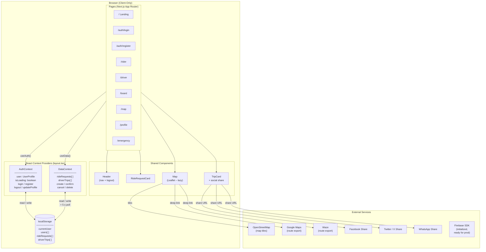
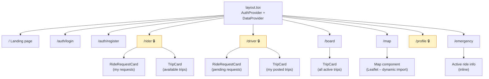
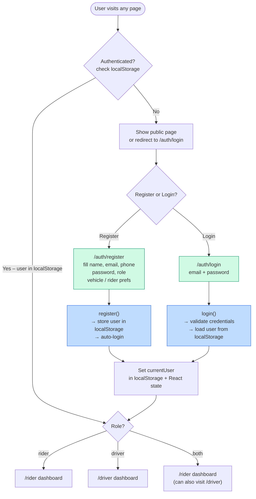
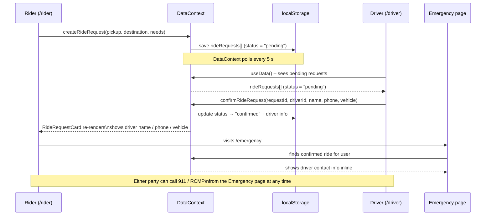
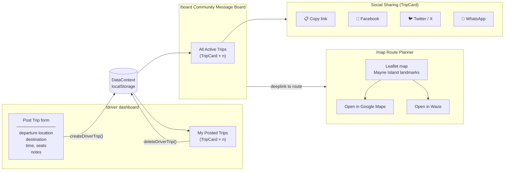
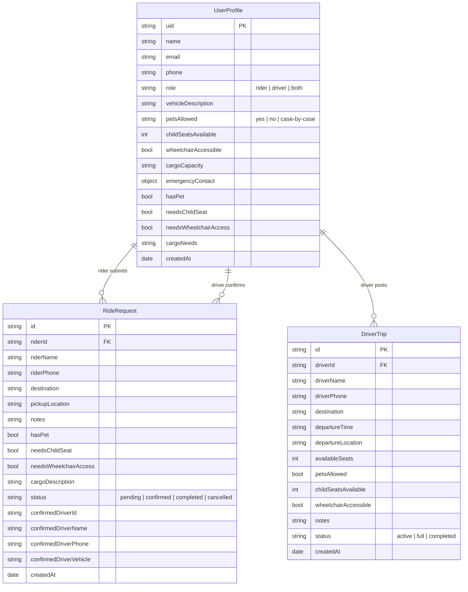
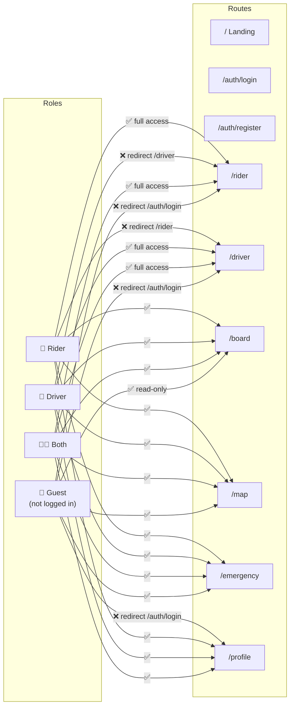
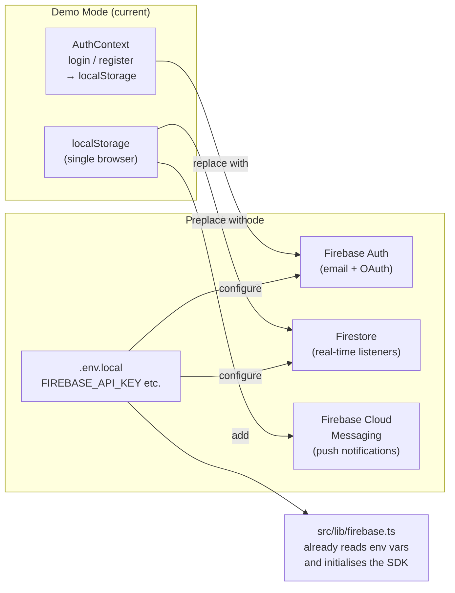

# Mayne Island Rideshare — Architecture

This document describes the structure and data flows of the application using flowcharts and schematics. All diagrams use [Mermaid](https://mermaid.js.org/) and render directly in GitHub.

---

## 1. High-Level System Overview

---

## 2. Page & Component Tree

> 🔒 = requires authentication. The page checks `isLoading` before redirecting so localStorage hydration completes first.

---

## 3. Authentication Flow

---

## 4. Ride Request Lifecycle

---

## 5. Driver Trip (Message Board) Flow

---

## 6. Data Layer

---

## 7. Role-Based Access Matrix

---

## 8. Production Upgrade Path

The app runs in **demo mode** today (localStorage only). To deploy for real community use:

> **Required `.env.local` keys** (see `.env.example`):
> `NEXT_PUBLIC_FIREBASE_API_KEY`, `NEXT_PUBLIC_FIREBASE_AUTH_DOMAIN`,
> `NEXT_PUBLIC_FIREBASE_PROJECT_ID`, `NEXT_PUBLIC_FIREBASE_STORAGE_BUCKET`,
> `NEXT_PUBLIC_FIREBASE_MESSAGING_SENDER_ID`, `NEXT_PUBLIC_FIREBASE_APP_ID`
