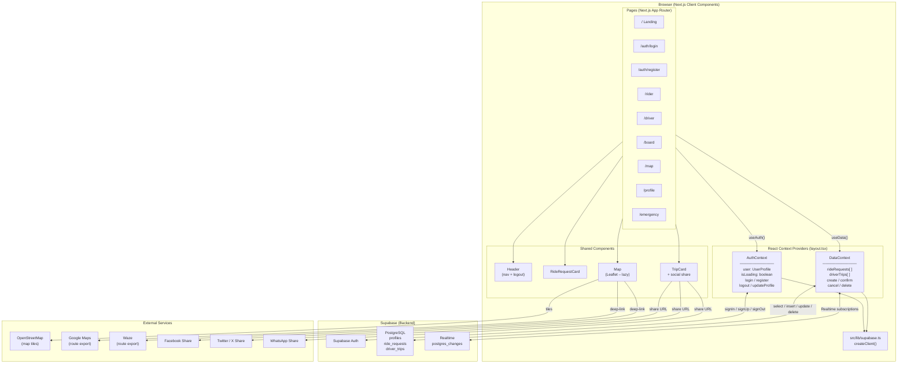
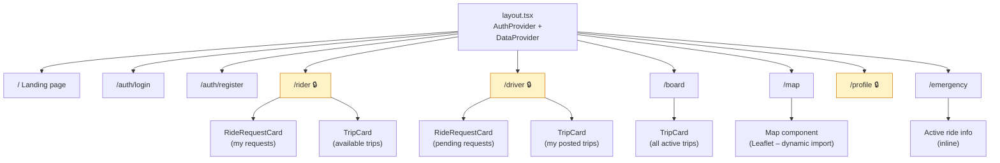
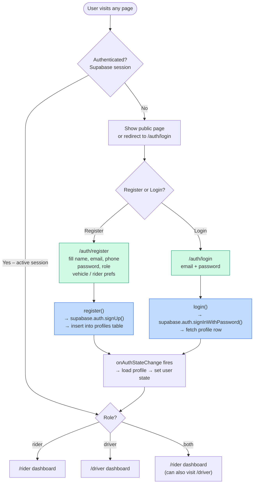
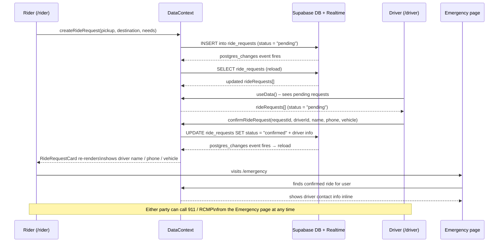
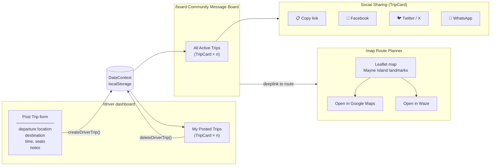
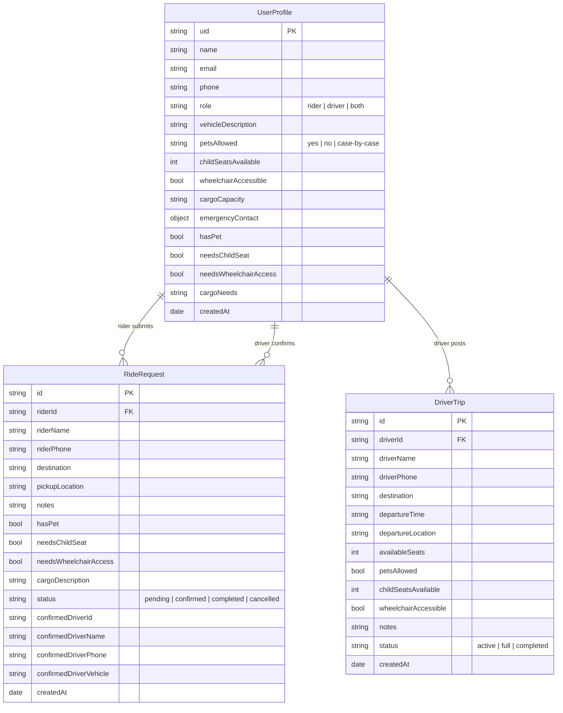
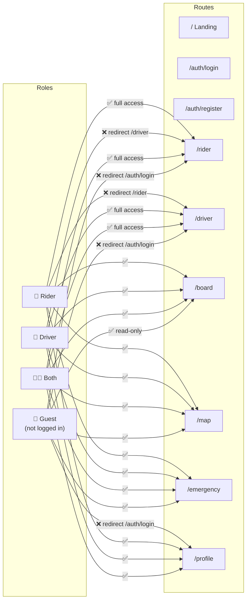
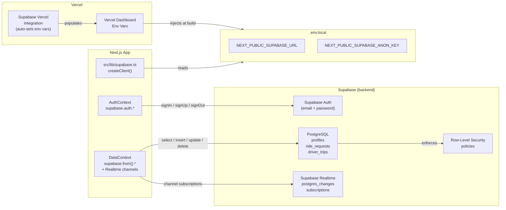

# Mayne Island Rideshare — Architecture

This document describes the structure and data flows of the application using flowcharts and schematics. All diagrams use [Mermaid](https://mermaid.js.org/) and render directly in GitHub.

---

## 1. High-Level System Overview

---

## 2. Page & Component Tree

> 🔒 = requires authentication. The page checks `isLoading` (set by Supabase's `onAuthStateChange`) before redirecting.

---

## 3. Authentication Flow

---

## 4. Ride Request Lifecycle

---

## 5. Driver Trip (Message Board) Flow

---

## 6. Data Layer

---

## 7. Role-Based Access Matrix

---

## 8. Deployment: Supabase + Vercel

The app uses **Supabase** for auth, PostgreSQL storage, and real-time sync, and **Vercel** for hosting.

> **Required `.env.local` keys** (see `.env.example`):
> `NEXT_PUBLIC_SUPABASE_URL`, `NEXT_PUBLIC_SUPABASE_ANON_KEY`
>
> Run [`supabase/schema.sql`](./supabase/schema.sql) in the Supabase SQL Editor to create all tables, RLS policies, and Realtime publications.
